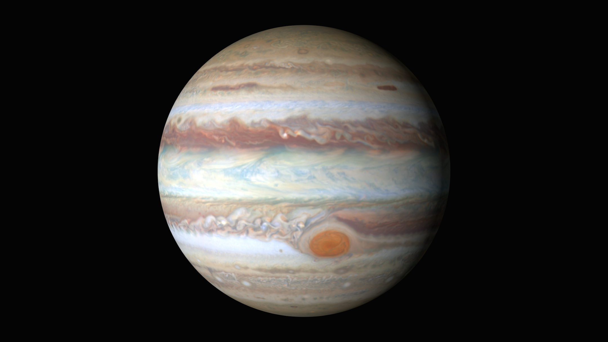

# Jupiter
Jupiter is the fifth planet from the Sun and the largest in the Solar System. It is a giant planet with a mass one-thousandth that of the Sun, but two and a half times that of all the other planets in the Solar System combined. Jupiter is a gas giant, along with Saturn, with the other two giant planets, Uranus and Neptune, being ice giants. Jupiter was known to astronomers of ancient times.[12] The Romans named it after their god Jupiter.[13] When viewed from Earth, Jupiter can reach an apparent magnitude of −2.94, bright enough for its reflected light to cast shadows,[14] and making it on average the third-brightest object in the night sky after the Moon and Venus.

Jupiter is primarily composed of hydrogen with a quarter of its mass being helium, though helium comprises only about a tenth of the number of molecules. It may also have a rocky core of heavier elements,[15] but like the other giant planets, Jupiter lacks a well-defined solid surface. Because of its rapid rotation, the planet's shape is that of an oblate spheroid (it has a slight but noticeable bulge around the equator). The outer atmosphere is visibly segregated into several bands at different latitudes, resulting in turbulence and storms along their interacting boundaries. A prominent result is the Great Red Spot, a giant storm that is known to have existed since at least the 17th century when it was first seen by telescope. Surrounding Jupiter is a faint planetary ring system and a powerful magnetosphere. Jupiter has at least 67 moons, including the four large Galilean moons discovered by Galileo Galilei in 1610. Ganymede, the largest of these, has a diameter greater than that of the planet Mercury.

Jupiter has been explored on several occasions by robotic spacecraft, most notably during the early Pioneer and Voyager flyby missions and later by the Galileo orbiter. In late February 2007, Jupiter was visited by the New Horizons probe, which used Jupiter's gravity to increase its speed and bend its trajectory en route to Pluto. The latest probe to visit the planet is Juno, which entered into orbit around Jupiter on July 4, 2016.[16][17] Future targets for exploration in the Jupiter system include the probable ice-covered liquid ocean of its moon Europa.

## Planet Information
* Orbital Period: 11.9 Years
* Radius: 71,492 KM
* Mass: 317.8 x Earth